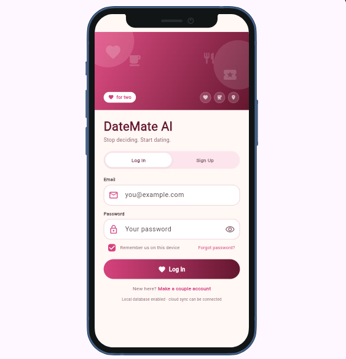
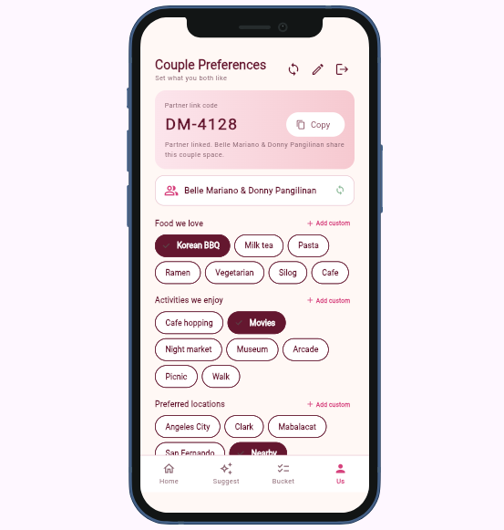
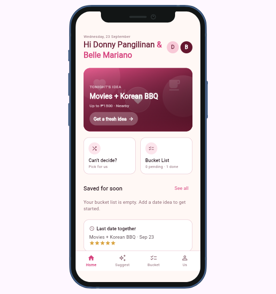
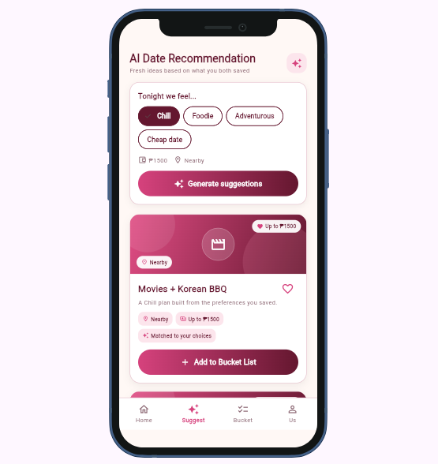
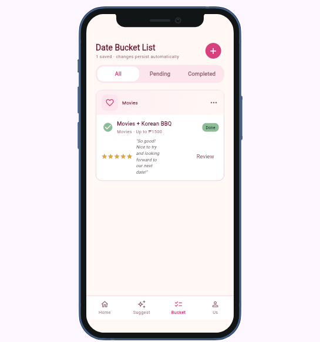

# Documentation guide 

## 1. Overview
DateMate AI is a mobile app made for people in relationships or couples who are not really used to planning their dates. It helps them choose and organize date activities based on their preferences, so they do not always have to just “go with the flow” or spend time deciding what to do. The app provides date ideas, helps users save activities they want to try, and makes planning their next date easier.

## 2. Setup and installation
I developed DateMate-AI using Flutter and Dart. The project requires Dart SDK 3.8.0 or higher. I used Visual Studio Code for developing the app and Google Chrome for testing it.

First, I clone the project from the GitHub repository:
git clone https://github.com/allainstephanie26-alt/DateMate-AI.git
cd DateMate-AI

Then, I install the packages used for my project:
flutter pub get

The project uses DevicePreview to display the app in a mobile-sized device preview, Hive for local storage, and Firebase packages for authentication and cloud data storage. The Firebase packages included in the project are firebase_core, firebase_auth, and cloud_firestore.

For testing the app in Chrome, run:
flutter run -d web-server --web-port 8080

After the app starts, Flutter will provide a local address such as:
http://localhost:8080

Open this address in a web browser to view the app. The app will display using DevicePreview, where the user can select different simulated phone devices and screen sizes to check how DateMate-AI looks on different devices.

When it works correctly, the Login/Sign Up screen should appear first. The user can then continue to the Couple Preferences, Home Dashboard, AI Date Recommendation, and Date Bucket List screens.

## 4. Features and usage
DateMate-AI is mainly used to help couples plan their dates instead of always deciding what to do at the last minute. The main flow starts from the Login/Sign Up screen and continues through the couple preferences, home dashboard, date recommendations, and bucket list.

1. Login/ Sign up
This is the first screen when opening the app. Users can either log in to an existing account or sign up by entering their name, email, and password. The login screen also has an option for resetting the password.
2. Couple Preferences
After logging in, users can set their preferences for their dates. They can choose things such as their preferred activities, food, locations, mood, and budget. These preferences are saved and are used when generating date suggestions.
3. Home Dashboard
This is the main page of the app. It shows information based on the user's saved couple data and date plans. Users can also access shortcuts for getting a fresh date idea, opening their Bucket List, or going to the recommendation section. The dashboard is scrollable so the different sections can still be viewed on a mobile-sized screen.
4. AI Date Recommendation
This screen lets users generate date ideas based on their saved preferences, budget, activities, food, and locations. If they still cannot decide, they can click “Can’t Decide? Pick for Us”, which uses the AI chatbot to help choose a date idea that matches their preferences and budget. The selected idea can then be added to the Bucket List.
5. Date Bucket List
The Bucket List is where saved date ideas are kept. Users can view their saved dates under All, Pending, or Completed. They can add a date manually, mark a date as completed, review a completed date, or remove a date from the list. The saved changes are stored locally so the information can remain available when using the app again.

## 5. Project structure
The main files of DateMate-AI are organized inside the lib/ folder. Each folder has a specific purpose for the app.

DateMate-AI/
│
├── assets/
│   └── screenshots/
│       ├── login.png
│       ├── preferences.png
│       ├── home.png
│       ├── ai_recommendation.png
│       └── bucket_list.png
│
├── lib/
│   ├── main.dart
│   ├── theme.dart
│   ├── models/
│   ├── services/
│   ├── state/
│   ├── screens/
│   └── widgets/
│
├── test/
│   └── widget_test.dart
│
├── web/
│   ├── index.html
│   └── manifest.json
│
├── .gitignore
├── AI-USAGE.md
├── analysis_options.yaml
├── LICENSE
├── pubspec.yaml
└── README.md

- assets/ = documentation screenshots.
- lib/ = all actual Flutter application code.
- test/ = Flutter testing files
- web/ = files needed for running the Flutter app on the web.
- .gitignore =  files Git should not track.
- AI-USAGE.md = AI usage documentation.
- analysis_options.yaml = Dart/Flutter code analysis settings.
- LICENSE = project license.
- pubspec.yaml = Flutter project configuration and dependencies.
- README.md = main project documentation.

## 6. Screenshots
## Screenshots

### Login / Sign Up

### Couple Preferences

### Home Dashboard

### AI Date Recommendation

### Date Bucket List

## 7. Known issues and next steps
- GitHub Pages deployment is not yet fully configured. The Flutter web build is being generated successfully, but the GitHub Pages deployment currently needs to be enabled/configured before the live demo can be accessed.
- Firebase integration still needs additional testing on the deployed web version to make sure authentication, cloud synchronization, and Firestore-related functions work correctly in the production environment.
- The date recommendation feature is currently based on the application's recommendation logic and available date ideas. Further refinement could make the recommendations more personalized.
- Some user flows still need additional testing to ensure that entered information, couple preferences, saved date ideas, and completed dates remain consistent across the application.
- The application is still undergoing final UI and usability testing on different screen sizes.

### Next steps

- Complete and verify the GitHub Pages deployment for the final live demo.
- Test Firebase authentication and cloud synchronization on the deployed web application.
- Further refine the date recommendation feature based on user preferences.
- Perform final testing of all five main screens and their interactions.
- Fix any remaining UI, navigation, or data-synchronization issues found during final testing.
- Complete the final documentation, screenshots, demo video, and security and privacy checklist before submission.